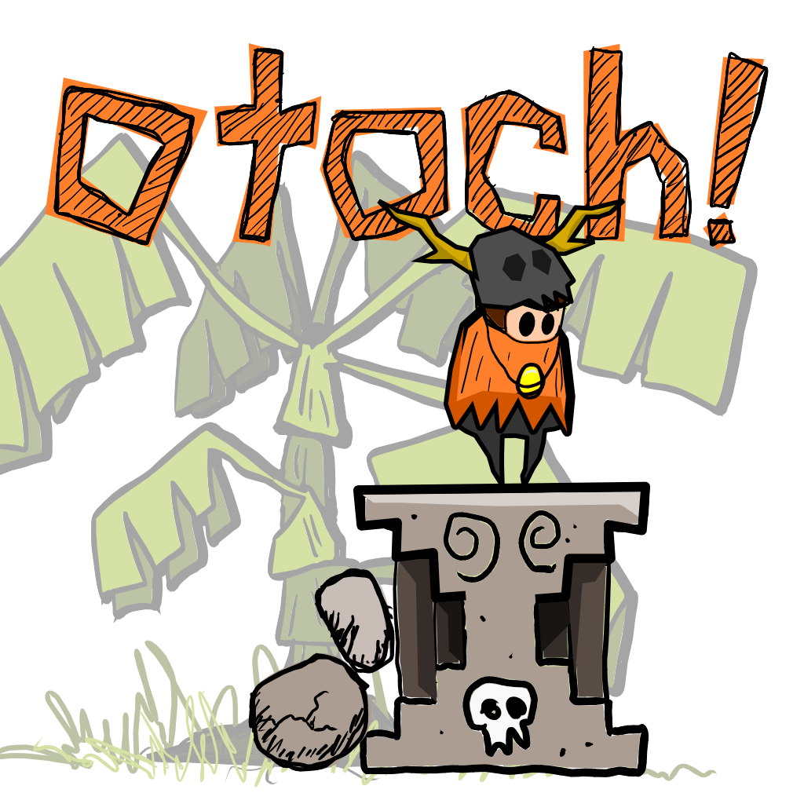
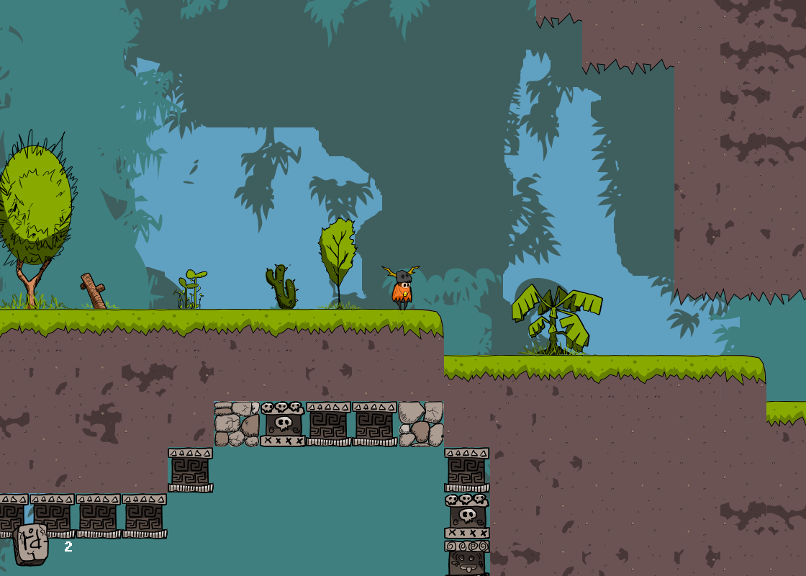

Mayan Megalithic Mayhem!

a shaman stuck in the forest on a distant world u crave the comfort of hearth and home but how will u get there?

[PLAY IT NOW!](https://retrogradeorbit.github.io/otoch/)

## Overview

For Global Game Jam 2019

## Setup

To get an interactive development environment run:

    lein figwheel

and open your browser at [localhost:3449](http://localhost:3449/).
This will auto compile and send all changes to the browser without the
need to reload. After the compilation process is complete, you will
get a Browser Connected REPL. An easy way to try it is:

    (js/alert "Am I connected?")

and you should see an alert in the browser window.

To clean all compiled files:

    lein clean

To create a production build run:

    lein do clean, cljsbuild once min

And open your browser in `resources/public/index.html`. You will not
get live reloading, nor a REPL.

## License

Copyright © 2019 Crispin Wellington and Chris McCormick

Distributed under the Eclipse Public License either version 1.0 or (at your option) any later version.
